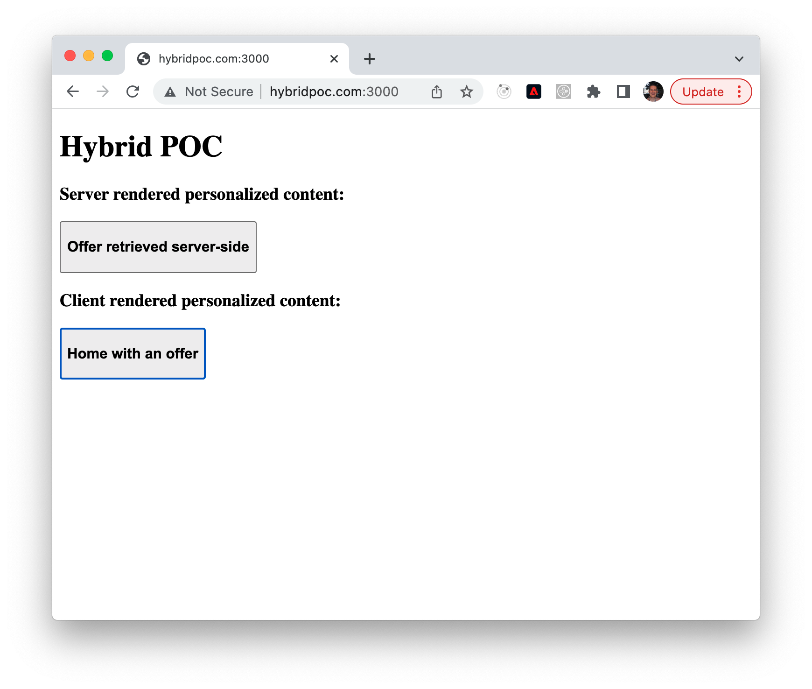

This is a proof of concept application to test out hybrid server side Adobe Experience Platform Experience Edge and Web SDK. It calls the Adobe Experience Platform data collection edge to retrieve an Adobe Target activity, and renders it on the server by including the activity html in the rendered page. Then in the browser, an initial page view event is recorded which fetches VEC type activities and renders them. Additionally, a display notification is sent for the server rendered activity and the VEC activity.

The server is a simple Node Express application ([app.js](app.js)) that renders an html page ([index.html](index.html)) using a simple string replacement type template. The strings `{{PERSONALIZED_CONTENT}}`, `{{DISPLAY_XDM}}`, and `{{CLICK_XDM}}` are replaced before returning the html to the browser. Additionally, this POC uses FPID to seed the ECID generation.

Cookies returned from experience edge are forwarded to the browser, and cookies from the browser request are forwarded to experience edge. The `kndctr...cluster` cookie holds a location hint that is used in the experience edge request URL. This cookie is also transferred to the browser so that server and browser calls will use the same Adobe Target cluster.

## Instruction to run

To run, first install dependencies:
```
npm install
```

Then run with node
```
node app.js
```

Update /etc/hosts to serve localhost at hybridpoc.com (The VEC activity is restricted to the site http://hybridpoc.com:3000 .)

```
127.0.0.1 hybridpoc.com
```

Load http://hybridpoc.com:3000 in a browser to test. It should look like this example:



